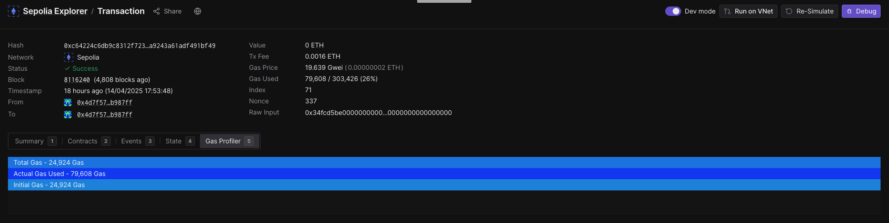
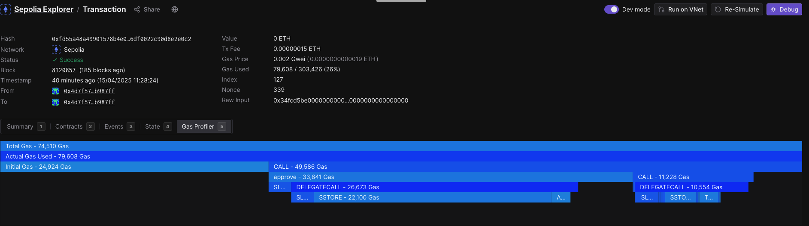

# Minimal One-Off 7702 Account PoC

> This proof-of-concept runs on Ethereum Sepolia with an Alchemy node provider.

## Requirements

- `node >= v22.14.0`
- `npm >= v10.9.2`

## Getting Started

1. Install dependencies:
   ```bash
   npm install
   ```
2. Fill in the required fields in `.env`.
3. Deposit the necessary tokens into your EOA and relay account.
4. Run the script:
   ```bash
   npx ts-node index.ts
   ```

## PoC Overview

1. The EOA signs a `henShinAuthorization` to **authorize** the [7702 Simple Account](https://github.com/eth-infinitism/account-abstraction/blob/develop/contracts/accounts/Simple7702Account.sol).
2. The EOA signs a `fukuGenAuthorization` to **de-authorize** the 7702 Simple Account. ([Reference](https://github.com/ethereum/EIPs/blob/master/EIPS/eip-7702.md#in-protocol-revocation))
3. Using the `executeBatch` function in the Simple 7702 Account, the following steps can be executed in a single transaction:
   - **HEN-SHIN**: Authorize the account (delegate control to the contract).
   - Execute complex operations, such as `approve` and token swaps on DEXs.
4. A second 7702 transaction can be sent for **FUKU-GEN**: to revoke the authorization. If the `address` field is set to `0x0000000000000000000000000000000000000000`, the previous authorization is invalidated.

## Toward a Single 7702 Transaction Solution

> Our goal is to compress the above three steps into a single 7702 transaction.

1. **Customized 7702 Account**: By introducing a revocation flag or variable in the account contract, revocation logic can be validated during the transaction's verification phase. A call to revoke can then be embedded in the multicall batch.
2. **Use Flashbots Bundles**: Leverage [Flashbots’ bundle API](https://docs.flashbots.net/guide-send-tx-bundle) to simulate atomic execution. **RESULT**: `shortMessage: 'unsupported transaction type'`.

## Rationale

### Paid by Relay

If your 7702 transaction gas is paid by the relay, you need to use the EntryPoint because the `execute` function requires the `msg.sender` should be `self` or `EntryPoint`. ([reference](https://github.com/eth-infinitism/account-abstraction/blob/develop/contracts/accounts/Simple7702Account.sol#L43))

### Must Wait for Block Confirmed

#### Scenario 1

If we sent two 7702 transaction in **very short interval (which means we don't wait for the block confirmed)**, the [first transaction](https://sepolia.etherscan.io/tx/0xc64224c6db9c8312f7237bfac1c981210a8e6fb635ce09a9243a61adf491bf49)'s [gas profile](https://dashboard.tenderly.co/tx/0xc64224c6db9c8312f7237bfac1c981210a8e6fb635ce09a9243a61adf491bf49) only shows from the perspective of EOA and it can not perform the ERC-20 interaction.



And the [second 7702 transaction](https://sepolia.etherscan.io/tx/0x843500d6d01b091d20183026a397d3a6fa29fc19b56d1e9516ad26e2744f4604) could not be sent successfully.

```
{
  address: '0x4Cd241E8d1510e30b2076397afc7508Ae59C66c9',
  chainId: 11155111,
  nonce: 338,
  r: '0x2233ef0d7dbc9f4fda3325884f2894e0258424575a5d26c15e67a43ccf63e6ce',
  s: '0x22982f0d9d3d64d48cc780ccf4e420df9b7e9cfbda0945c88bfb3049bbdba0e7',
  v: 28n,
  yParity: 1
}
Hen-Shin 7702 Transaction hash: 0xc64224c6db9c8312f7237bfac1c981210a8e6fb635ce09a9243a61adf491bf49
Bytecode after Hen-Shin:  0xef01004cd241e8d1510e30b2076397afc7508ae59c66c9

Without waiting here, do the Fuku-Gen instantly...

{
  address: '0x0000000000000000000000000000000000000000',
  chainId: 11155111,
  nonce: 339,
  r: '0x1cc734c7f769b76ad35bb0734ce3c1e892828a40d077ee2f10ce8390dd74fcee',
  s: '0x2dc6e4ee0dda3a98db42e1dfdc3cc9b6b509862e662c26bdc25ef4c788df76a9',
  v: 27n,
  yParity: 0
}
Fuku-Gen 7702 Transaction hash: 0x843500d6d01b091d20183026a397d3a6fa29fc19b56d1e9516ad26e2744f4604
Bytecode after Hen-Shin:  0xef01004cd241e8d1510e30b2076397afc7508ae59c66c9
```

#### Scenario 2

If we sent two 7702 transaction with **an interval (which means we wait for the block confirmed)**, the [first transaction](https://sepolia.etherscan.io/tx/0xfd55a48a49901578b4e0c0ac96724360130a5c5a68905d6df0022c90d8e2e0c2)'s [gas profile](https://dashboard.tenderly.co/tx/0xfd55a48a49901578b4e0c0ac96724360130a5c5a68905d6df0022c90d8e2e0c2) can shows from the perspective of CA.



And the [second 7702 transaction](https://sepolia.etherscan.io/tx/0x491f886bc5c3786506f70fa3f520406fa39f0bb6c965cfcdbc1b60221cba70e1)([gas profile](https://dashboard.tenderly.co/tx/sepolia/0x491f886bc5c3786506f70fa3f520406fa39f0bb6c965cfcdbc1b60221cba70e1)) can be sent successfully.

```
{
  address: '0x4Cd241E8d1510e30b2076397afc7508Ae59C66c9',
  chainId: 11155111,
  nonce: 340,
  r: '0x2fe543903ab8a93074f7c86020571dfed1f3f08774b56226daf3a72712d99be6',
  s: '0x04c1bae4eaed26a4ec6696e6444d32dcc86e0c19b139b8c8b79a71b9b339d535',
  v: 28n,
  yParity: 1
}
Hen-Shin 7702 Transaction hash: 0xfd55a48a49901578b4e0c0ac96724360130a5c5a68905d6df0022c90d8e2e0c2
Bytecode after Hen-Shin:  0xef01004cd241e8d1510e30b2076397afc7508ae59c66c9

Wait for few minutes...

{
  address: '0x0000000000000000000000000000000000000000',
  chainId: 11155111,
  nonce: 342,
  r: '0xccebbac6c2a1ebee0b8d81b2cf423f5b568095f960faeebc4faeb8e89844e01c',
  s: '0x112806094e5bec97d7d9eff3cc267f5dd0500c7fdaa26442b1593fa6939a35b8',
  v: 27n,
  yParity: 0
}
Fuku-Gen 7702 Transaction hash: 0x491f886bc5c3786506f70fa3f520406fa39f0bb6c965cfcdbc1b60221cba70e1
Bytecode after Fuku-Gen:  undefined
```

## Gas Profile

| Operaion                                                                                                                       | Gas Usage              | Gas Price  | Gas Cost        |
| ------------------------------------------------------------------------------------------------------------------------------ | ---------------------- | ---------- | --------------- |
| [Hen-Shin](https://sepolia.etherscan.io/tx/0xda96a07ad2ff6b690468b928fd9ee580cddcaee5c5e5188efa0b23ab5ce5de73)                 | 36,837 / 88,848 (41%)  | 0.002 Gwei | 0.000000073 ETH |
| [MultiCall after Hen-Shin](https://sepolia.etherscan.io/tx/0xccec20d51edb7b4b58d94031a4ef07ae391a8635d291203cc76b5119f98d7f47) | 59,608 / 78,029 (76%)  | 0.002 Gwei | 0.00000012 ETH  |
| [Hen-Shin + MultiCall](https://sepolia.etherscan.io/tx/0xfd55a48a49901578b4e0c0ac96724360130a5c5a68905d6df0022c90d8e2e0c2)     | 79,608 / 303,426 (26%) | 0.002 Gwei | 0.00000015 ETH  |
| [Fuku-Gen](https://sepolia.etherscan.io/tx/0x491f886bc5c3786506f70fa3f520406fa39f0bb6c965cfcdbc1b60221cba70e1)                 | 36,800 / 88,382 (42%)  | 0.002 Gwei | 0.00000007 ETH  |

We can see that compressing the Hen-Shin and target operation (included in MultiCall) could save `36,837 + 59,608 - 79,608 = 16,837` gas usage.
